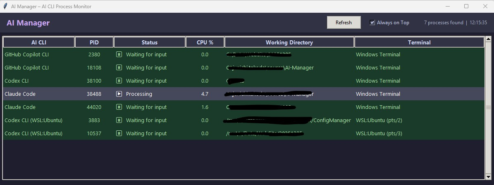
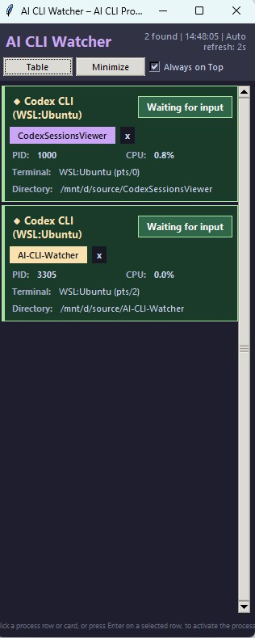

<p align="left">
  <a href="README_en.md"></a>
  <a href="README.md"></a>
</p>

# AI Manager - AI CLI Process Monitor

A Windows desktop application that monitors AI CLI tools (Claude Code / Codex CLI / GitHub Copilot CLI) in real time and displays their operational status.

## Features

| Feature | Description |
|---------|-------------|
| Automatic process detection | Automatically detects AI CLI processes running on Windows and WSL |
| Status display | Shows each process state as "Processing" or "Waiting for input" |
| Color-coded status | Green background for waiting, red background for processing — status is visible at a glance |
| Display modes | Supports the `Wide` (horizontal list) view, the `Portrait` (vertical cards) view, and the `Minimize` (minimized) view. Size and position are stored independently for each view |
| Label management | Saves a label name and color per working directory. Labels can be edited from the `Label` column in `Wide` view and the `+ Label` button in `Portrait` view |
| Window switching | Double-click a process row or card to bring its terminal window to the foreground. The app also attempts to restore minimized terminal windows |
| Working directory display | Shows the directory each CLI is running in, making it easy to distinguish multiple instances |
| Terminal type display | Shows the terminal type such as Windows Terminal, PowerShell, Command Prompt, etc. |
| Always on Top | The `Top` checkbox keeps the window above all others (setting is persisted automatically) |
| 1-second auto-refresh | In `Wide` and `Portrait`, process information is refreshed every second. In `Minimize` view, refresh pauses and runs immediately on `Restore` |

## Supported CLIs

| CLI | Windows | WSL |
|-----|---------|-----|
| Claude Code (Anthropic) | ✅ | ✅ |
| Codex CLI (OpenAI) | ✅ | ✅ |
| GitHub Copilot CLI | ✅ | ✅ |

- Supports simultaneous detection of multiple instances of each CLI
- Detects processes launched via node/npm/npx wrappers
- Filters out false positives such as VS Code extension background processes and the Windows Copilot app

## System Requirements

- **OS**: Windows 10 / 11
- **Python**: 3.10 or later
- **Dependencies**: psutil

## Setup

### 1. Install dependencies

```
pip install -r requirements.txt
```

### 2. Launch

#### Launch from batch file (recommended)

Double-click `scripts\windows\launch_ai_manager.bat`.

#### Launch from command line

```
python ai_manager.py
```

## Usage

### Screen Layout

The visible controls differ by display mode. The following images show each mode.

| Display Mode | Sample Image |
|--------------|--------------|
| `Wide` |  |
| `Portrait` |  |
| `Minimize` |  |

### Item Descriptions

| Item | Description |
|------|-------------|
| AI CLI | CLI name. For WSL processes, `(WSL:<distro name>)` is appended |
| PID | Process ID |
| Status | `▶ Processing` (busy) or `⏸ Waiting for input` (idle) |
| CPU % | Combined CPU usage across the entire process tree |
| Label | Label name. In `Wide`, it appears in the Label field and shows `+ Label` when unset or `No Label` when no directory is available. In `Portrait`, it appears as the `+ Label` button or as the saved label on each card |
| Working Directory | The directory where the CLI is running |
| Terminal | Terminal type (Windows Terminal, PowerShell, etc.) |

### Controls

| Action | Behavior |
|--------|----------|
| `Portrait` / `Wide` button | Switches between `Wide` and `Portrait`. Each view remembers its own size and position |
| `Minimize` button | Switches to a compact view that only shows the `Restore` button |
| `Restore` button | Returns from the compact `Minimize` view to the previous display and position, then refreshes immediately |
| `+ Label` button | Click `+ Label` to add or edit a label |
| Double-click / Enter | Brings the selected CLI's terminal window to the foreground and attempts to restore minimized terminal windows |
| Refresh button | Manually refreshes the process list |
| Top checkbox | When checked, the AI Manager window stays above all other windows |

Labels cannot be saved for processes whose working directory is unavailable.

### Status Detection Logic

On both Windows and WSL, status is determined by two signals. If either exceeds its threshold, the process is marked as `Processing`; otherwise it is `Waiting for input`.

| Signal | Threshold | Description |
|--------|-----------|-------------|
| Tree CPU | 2.0% | Combined CPU usage of the process and all its child processes |
| I/O Delta | 1,000 bytes | Total I/O growth since the previous scan |

- On Windows, CPU and I/O are read from the process tree via `psutil`
- On WSL, CPU and I/O are derived from `/proc` CPU ticks and I/O counters

### Persisted Settings

The following settings are saved in `settings.json` and restored across application restarts.
If `settings.json` is missing, unreadable as JSON, or has an invalid settings structure, the app recreates it on startup using only managed settings, preserving valid values and filling missing ones with system defaults.

| Setting | Stored in |
|---------|-----------|
| Top checkbox state | `settings.json` (`always_on_top`) |
| Last normal display mode (`Wide` or `Portrait`) | `settings.json` (`layout_mode`) |
| Window size and position for each view (`Wide` / `Portrait` / `Minimize`) | `settings.json` (`window_geometries.landscape` / `portrait` / `minimized`) |
| Label name and color per working directory | `settings.json` (`process_labels`) |

## File Structure

```
AI-Manager/
├── ai_manager.py          # Main application
├── requirements.txt        # Dependencies (psutil)
├── settings.json           # User settings (auto-generated)
├── .gitignore
├── scripts/
│   └── windows/
│       └── launch_ai_manager.bat   # Launch script
└── README.md               # Documentation (Japanese)
```

## Technical Notes

- Built with **pure Python + tkinter + ctypes**. PowerShell is not used at all.
- **Win32 API (ctypes)**: Uses `EnumWindows`, `SetForegroundWindow`, `AttachConsole`, `GetConsoleWindow`, and other APIs to detect and activate windows.
- **WSL support**: Detects processes inside WSL using `wsl --list` and `wsl -d <distro> -- ps -eo ...`. Working directories are resolved via batched `readlink` calls.
- **Window switching**: Even in multi-tab environments like Windows Terminal, the correct tab HWND is resolved via `AttachConsole`/`GetConsoleWindow`, and the app restores parent windows when needed before bringing them to the foreground.

## Verification Status

| Environment | CLI | Status |
|-------------|-----|--------|
| Windows | Claude Code | ✅ Verified |
| Windows | Codex CLI | ✅ Verified |
| Windows | GitHub Copilot CLI | ✅ Verified |
| WSL | Codex CLI | ✅ Verified |
| WSL | Claude Code | ✅ Verified |
| WSL | GitHub Copilot CLI | ✅ Verified |

## ❗This project is licensed under the MIT License, see the LICENSE file for details
